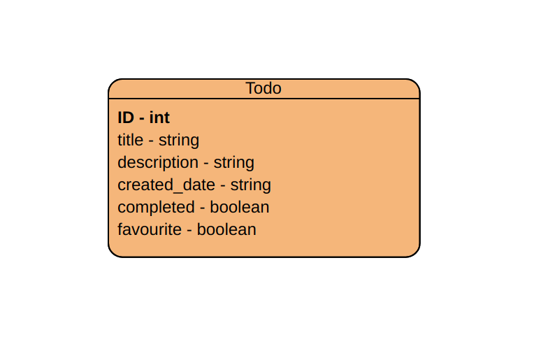
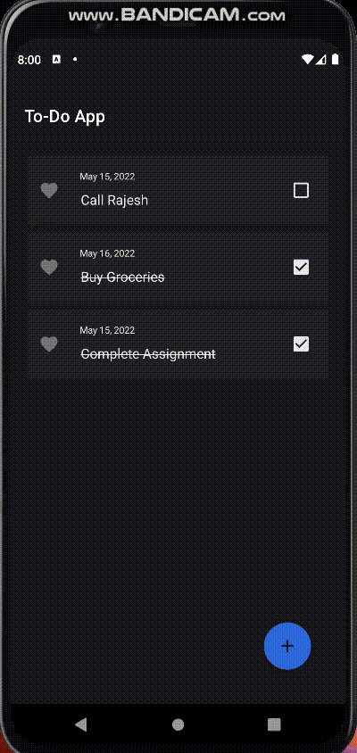

## Final Component DMA : Todo Application  

### Database Schema
The image below shows the ERD of the database that was used in the application. It has only one table which stores all todo related items.  

### Opening an App

While launching the app, loading screen animation is displayed. Currently, no items are present, so we are presented with 'Nothing To-do' Image

 

### Adding an Item

Items can be added by simply clicking on Floating Add icon on bottom left.

 

### Updating an Item

Clicking on individual item gives an option to edit or delete it.

 

### Deleting an Item

While deleting, confirmation box appears.

 

### Clicking on Checkbox

We are presented with Toast message after clicking on checkbox of a to-do item.

 

### Adding to Favourites

Items can be added to favourites.

### Reordering Items

Items can be dragged in order to re-order it.

 

### No-Item Image is shown when no Todo items are present

Currently, no items are present, so we are presented with 'Nothing To-do' Image

 

### Closing an App

 While exiting, confirmation box appears 

 
