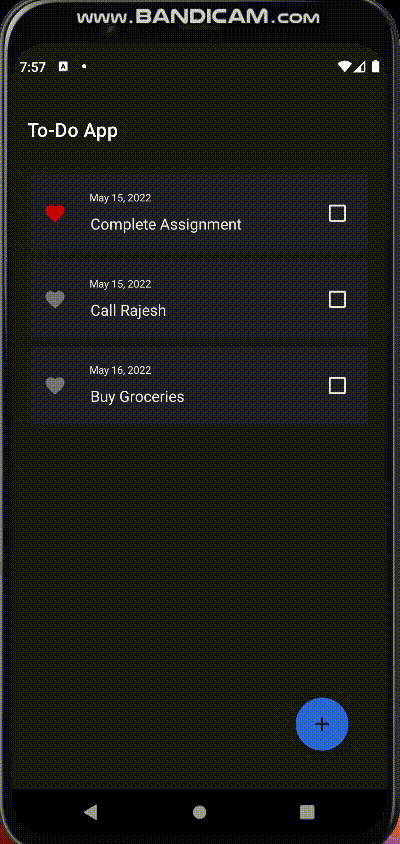

## Todo Application

### Opening an App

### Adding an Item

### Updating an Item

### Deleting an App

### Clicking on Checkbox

### Reordering Items

### No-Item Image is shown when no Todo items are present

### Closing an App

